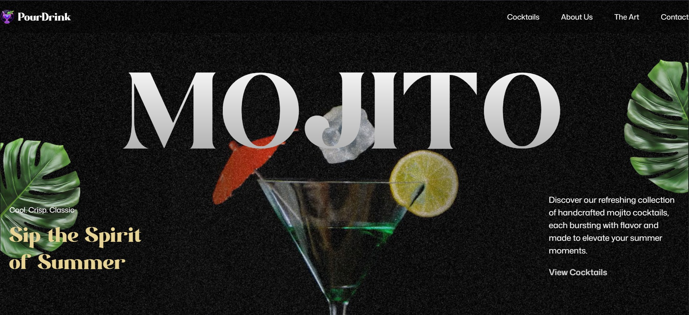

# PourDrink 🍹

**Cool. Crisp. Classic.**

A modern, interactive cocktail and mocktail website built with React and enhanced with smooth GSAP animations. PourDrink showcases handcrafted mojito cocktails and refreshing mocktails, designed to elevate your summer moments.


## 🚀 Live Demo
[🔗 Live Site URL](https://pourdrink.vercel.app/)

## ✨ Features

- **Interactive Cocktail Menu** - Browse through classic and signature cocktails
- **Mocktail Collection** - Refreshing non-alcoholic alternatives
- **Smooth Animations** - Enhanced user experience with GSAP animations
- **Responsive Design** - Optimized for all devices using Tailwind CSS
- **Recipe Details** - Detailed ingredient lists and preparation methods
- **Store Locator** - Contact information and store hours
- **Customer Reviews** - 4.5/5 rating from 12,000+ satisfied customers

## 🛠️ Tech Stack

- **Frontend**: React 19.1.0
- **Styling**: Tailwind CSS 4.1.11
- **Animations**: GSAP 3.13.0 with React integration
- **Build Tool**: Vite 7.0.4
- **Responsive Design**: React Responsive 10.0.1
- **Language**: JavaScript/TypeScript

## 🚀 Getting Started

### Prerequisites

- Node.js (version 16 or higher)
- npm or yarn package manager

### Installation

1. Clone the repository
```bash
git clone https://github.com/iamarshalrejith/pourdrink.git
cd pourdrink
```

2. Install dependencies
```bash
npm install
```

3. Start the development server
```bash
npm run dev
```

4. Open your browser and navigate to `http://localhost:5173`

## 📝 Available Scripts

```bash
# Start development server
npm run dev

# Build for production
npm run build

# Lint code
npm run lint

# Preview production build
npm run preview
```

## 🏗️ Project Structure

```
pourdrink/
├── src/
│   ├── components/
│   │   ├── Navbar/
│   │   ├── Hero/
│   │   ├── Cocktails/
│   │   ├── Art/
│   │   ├── Menu/
│   │   ├── About/
│   │   └── Contact/
│   ├── assets/
│   ├── styles/
│   └── App.jsx
├── public/
├── package.json
└── README.md
```


## 🔧 Development

### Key Dependencies

- **@gsap/react**: Smooth animations and transitions
- **tailwindcss**: Utility-first CSS framework
- **react-responsive**: Responsive design utilities
- **vite**: Fast build tool and dev server

### Animation Features

The project uses GSAP for creating smooth, professional animations including:
- Page transitions
- Menu hover effects
- Scroll-triggered animations
- Loading animations

## 🤝 Contributing

We welcome contributions! Please follow these steps:

1. Fork the repository
2. Create a feature branch (`git checkout -b feature/amazing-feature`)
3. Commit your changes (`git commit -m 'Add amazing feature'`)
4. Push to the branch (`git push origin feature/amazing-feature`)
5. Open a Pull Request

## 📜 License

This project is licensed under the MIT License - see the [LICENSE](LICENSE) file for details.

